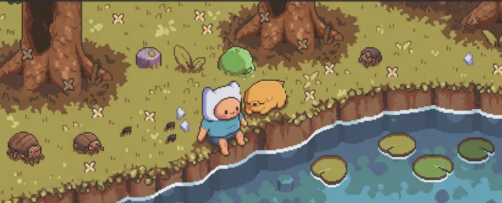

  

  

---

### About Me
I build backend and systems-focused projects, primarily using **Go, JavaScript, and Python**. My work leans toward networking, terminal tooling, protocol-level experiments, and practical utilities.

Beyond systems, I also explore **ML, data science, and web development**.

### Tech Stack

| Category | Tools & Languages |
| :--- | :--- |
| **Languages** | Go, JavaScript, Python, C, HTML, CSS |
| **Backend & Systems** | Node.js, Express, Go, net/http, Python, REST APIs, WebSockets, WebRTC |
| **Projects I Tend To Build** | CLI tools, small backend services, visualizers, utility apps, networking experiments |
| **Workflow** | Git, GitHub, Neovim, local-first development, iterative side projects |

### Current Focus
* **Systems:** learning through small networked and terminal-based projects in **Go** and **C**
* **Backend:** building **practical services and utilities** instead of template-heavy apps
* **Tooling:** exploring projects like **git visualisation, SSH honeypots, and custom servers**

### Selected Work
* **[SSH-Honeypot](https://github.com/Ashking-tech/SSH-Honeypot):** a Go-based security/networking experiment
* **[bittorent-client-](https://github.com/Ashking-tech/bittorent-client-):** a JavaScript-side protocol and systems-oriented build

---

### Connect
* **GitHub:** [Ashking-tech](https://github.com/Ashking-tech)
* **Website:** [ashking-tech.github.io](https://ashking-tech.github.io/)
* **Email:** Ashking21@proton.me

---

> "I build to understand systems, then keep the useful parts."
# Ashking-tech
